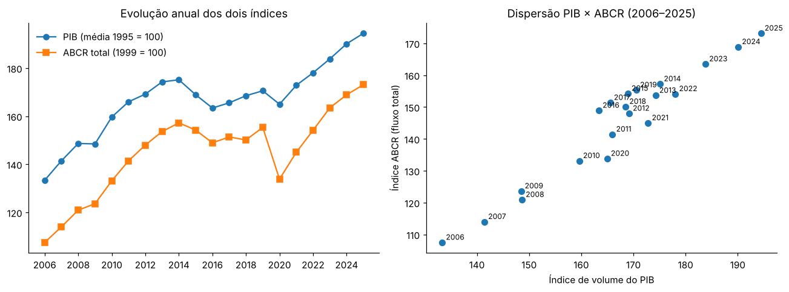
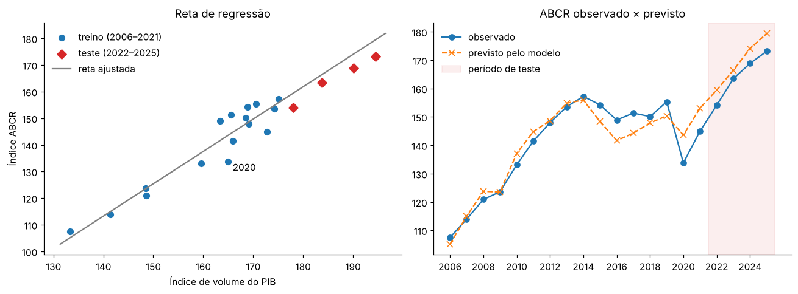

# Regressão linear com PIB e Índice ABCR

Investigação da relação entre a **atividade econômica brasileira** (índice de volume do PIB, IBGE) e o **fluxo de veículos nas rodovias pedagiadas** (Índice ABCR), com um modelo de regressão linear em Python.

## Integrantes

| Nome | RM |
|---|---|
| Vinicius Molena | 571270 |
| Matheus Ferreira | 569638 |
| Ricardo Algazi | 569600 |
| Nathan Werner | 572925 |
| Gabriel Vilas | 571603 |
| Gustavo Henrique | 569921 |

## A tarefa

O Produto Interno Bruto (PIB) é o valor dos bens e serviços finais produzidos em um país durante um período. O **índice de volume do PIB** acompanha a evolução da produção descontando o efeito das mudanças de preços: é construído encadeando as variações reais e adota um período de referência igual a 100 (na série utilizada, a média de 1995 = 100). Um índice de 120 representa um volume de produção 20% maior que o da referência.

Etapas pedidas:

1. **Pesquisa dos dados** – índice de volume do PIB (IBGE, SIDRA Tabela 1620, Brasil, “PIB a preços de mercado”) e Índice ABCR de fluxo total de veículos (série original). Séries sem ajuste sazonal, 20 anos completos em comum (2006–2025).
2. **Organização da base** – tabela com `Ano`, `PIB_indice` (média dos 4 trimestres) e `ABCR_indice` (média dos 12 meses).
3. **Análise da relação** – gráfico de dispersão (PIB no eixo x, ABCR no eixo y) e correlação.
4. **Treinamento** – `LinearRegression` do scikit-learn com X = `PIB_indice`, y = `ABCR_indice`; treino nos 16 primeiros anos e teste nos 4 últimos, mantendo a ordem cronológica.
5. **Avaliação** – MAE, MSE e R² no teste, tabela observado × previsto e interpretação.

## Estrutura do repositório

```
├── README.md
├── regressao_pib_abcr.ipynb        # notebook com fontes, código, resultados e conclusões
├── requirements.txt
├── data/
│   ├── raw/
│   │   ├── tabela1620.csv          # IBGE/SIDRA – PIB trimestral, índice encadeado (1995=100)
│   │   └── abcr_0826.xlsx          # ABCR – histórico mensal (edição ago/2026), aba "(C) Original"
│   └── processed/
│       ├── base_anual_pib_abcr.csv # base anual 2006–2025 usada no modelo
│       └── resultado_teste.csv     # observado × previsto (2022–2025)
└── img/
    ├── series_e_dispersao.png
    └── regressao_e_previsao.png
```

## Fontes

| Indicador | Fonte | Série |
|---|---|---|
| PIB | [IBGE – SIDRA, Tabela 1620](https://sidra.ibge.gov.br/tabela/1620) | Série encadeada do índice de volume trimestral (média 1995 = 100), Brasil, PIB a preços de mercado, sem ajuste sazonal |
| Fluxo de veículos | [ABCR – Índice ABCR](https://melhoresrodovias.org.br/indice-abcr/) → “Ver histórico” | Série original (1999 = 100), Brasil, fluxo **total** (leves + pesados), mensal |

## Base anual (2006–2025)

| Ano | PIB_indice | ABCR_indice |
|---|---|---|
| 2006 | 133,35 | 107,49 |
| 2007 | 141,45 | 113,99 |
| 2008 | 148,65 | 120,91 |
| 2009 | 148,47 | 123,60 |
| 2010 | 159,64 | 133,12 |
| 2011 | 165,98 | 141,44 |
| 2012 | 169,18 | 147,97 |
| 2013 | 174,26 | 153,59 |
| 2014 | 175,14 | 157,23 |
| 2015 | 168,93 | 154,25 |
| 2016 | 163,39 | 148,91 |
| 2017 | 165,56 | 151,36 |
| 2018 | 168,51 | 150,12 |
| 2019 | 170,56 | 155,34 |
| 2020 | 164,98 | 133,81 |
| 2021 | 172,83 | 144,99 |
| 2022 | 178,05 | 154,12 |
| 2023 | 183,82 | 163,49 |
| 2024 | 190,10 | 168,88 |
| 2025 | 194,45 | 173,12 |

Todos os anos têm 4 trimestres (PIB) e 12 meses (ABCR). 2026 foi excluído por estar incompleto (2 trimestres / 8 meses).

## Resultados



* **Correlação de Pearson (2006–2025): r = 0,964**
* **Modelo (treino 2006–2021):** `ABCR = −56,79 + 1,2145 × PIB` — R² no treino = 0,901



**Teste (2022–2025):**

| Ano | PIB_indice | ABCR observado | ABCR previsto | Erro (obs − prev) | Erro % |
|---|---|---|---|---|---|
| 2022 | 178,05 | 154,12 | 159,46 | −5,34 | −3,5% |
| 2023 | 183,82 | 163,49 | 166,47 | −2,98 | −1,8% |
| 2024 | 190,10 | 168,88 | 174,10 | −5,22 | −3,1% |
| 2025 | 194,45 | 173,12 | 179,38 | −6,26 | −3,6% |

| Métrica | Valor | Significado |
|---|---|---|
| MAE | 4,95 pontos | erro médio absoluto, na unidade do índice (~3% do valor observado) |
| MSE | 25,95 pontos² | média dos erros ao quadrado; penaliza erros grandes (RMSE = 5,09) |
| R² | 0,485 | fração da variância do teste explicada pelo modelo, comparado a prever a média |

## Conclusões

* Há uma **associação positiva e forte** entre PIB e fluxo rodoviário: r = 0,96, e o PIB explica ~90% da variação do Índice ABCR no período de treino. Cada ponto a mais no índice do PIB corresponde, em média, a ~1,21 ponto a mais no Índice ABCR.
* No teste, o modelo **acertou a tendência** (crescimento contínuo em 2022–2025, com inclinação parecida) e errou em média ~3%, mas **superestimou o fluxo em todos os quatro anos**. Esse viés sistemático explica o R² moderado (0,48): com apenas 4 pontos de teste e pouca variação entre eles, um deslocamento constante pesa muito.
* O viés sugere uma **mudança de patamar pós‑pandemia**: depois de 2020 (quando o fluxo caiu ~14% e o PIB ~3%), o mesmo nível de PIB passou a vir acompanhado de um pouco menos tráfego — possível efeito de trabalho remoto/híbrido, digitalização de serviços e mudanças na composição do PIB.
* **Correlação não implica causalidade.** As duas séries compartilham tendência de longo prazo (população, frota, novas concessões) e reagem aos mesmos choques; a influência pode ainda ser bidirecional. O modelo descreve associação, não efeito causal.
* Limitações e extensões possíveis: poucas observações (20 anuais, 4 no teste), um único preditor e séries com tendência. Vale testar dados trimestrais, variações percentuais em vez de níveis, a série de veículos **pesados** (mais ligada à produção) e uma variável indicadora pós‑2020.

## Dificuldades e soluções

* **CSV do SIDRA** em formato largo, com cabeçalhos extras, BOM, `;` e decimal `,` → leitura seletiva das linhas, conversão de decimal e transformação para formato longo.
* **Planilha da ABCR** com várias abas e cabeçalho mesclado → uso da aba “(C) Original” (sem ajuste sazonal) e da coluna Brasil/TOTAL, com verificação automática do cabeçalho.
* **Anos incompletos** (ABCR só desde 1999; 2026 parcial) → contagem de períodos por ano e `assert` garantindo 4 trimestres e 12 meses em todos os anos usados.
* **Bases diferentes** (1995 = 100 × 1999 = 100) → mantidas; a regressão absorve a diferença de escala, mas os níveis não são comparáveis entre si.
* **Série temporal** → divisão treino/teste por posição, sem embaralhar.
* **2020 atípico** → mantido no treino (sem escolher dados a dedo) e discutido na análise.

Detalhes, código e justificativas estão no notebook [`regressao_pib_abcr.ipynb`](regressao_pib_abcr.ipynb).

## Como reproduzir

```bash
pip install -r requirements.txt
jupyter notebook regressao_pib_abcr.ipynb
```
